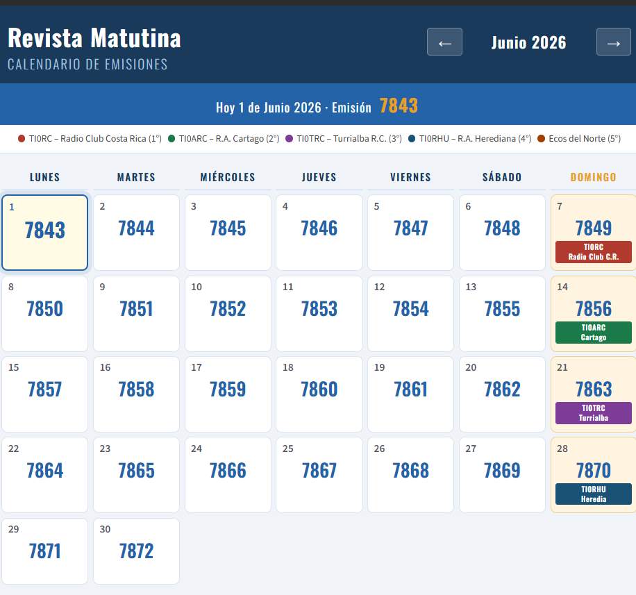

# 📻 Revista Matutina — Calendario de Emisiones

> Calendario perpetuo de numeración de emisiones de la **Revista Matutina**,
> con asignación automática de clubes para los días domingo.

---

## 🔗 Ver en línea

**[→ ti3wti.github.io/CALENDARIO-MATUTINA](https://ti3wti.github.io/CALENDARIO-MATUTINA)**

---

## 📸 Vista previa

<!-- Después del primer deploy, reemplace esta línea con:
     
     Tome una captura de pantalla del sitio y súbala a la carpeta docs/ -->


---

## ✨ Características

- 📅 **Calendario mensual** navegable (mes anterior / mes siguiente)
- 🔢 **Número de emisión** calculado automáticamente según la fecha
- 🌟 **Día de hoy** resaltado con parpadeo suave azul ↔ amarillo
- 📡 **Domingos** con badge de color indicando el club a cargo:

| Domingo del mes | Club | Indicativo |
|:-:|---|:-:|
| 1° | Radio Club de Costa Rica | **TI0RC** |
| 2° | Asociación de Radioaficionados de Cartago | **TI0ARC** |
| 3° | Turrialba Radio Club | **TI0TRC** |
| 4° | Asociación de Radioaficionados Herediana | **TI0RHU** |
| 5° | Ecos del Norte | **Ecos del Norte** |

---

## ⚙️ Ajuste de numeración

Si en algún momento la numeración se corre (emisión doble en fin de año,
o algún día no transmitido), edite el archivo `config.json` directamente
en GitHub:

```json
{
  "ajuste": 0
}
```

| Valor | Cuándo usarlo |
|:-:|---|
| `0` | Situación normal |
| `+1` | Se saltó un día (no se transmitió) |
| `-1` | Se hizo una emisión extra el mismo día |

El sitio lee este archivo en cada visita — no requiere redespliegue.

---

## 🚀 Instalación en GitHub Pages

1. Haga fork o clone de este repositorio
2. Vaya a **Settings → Pages**
3. En *Source*, seleccione la rama `main` y carpeta `/ (root)`
4. Guarde — en unos minutos el sitio estará activo

### Estructura del repositorio

```
/
├── index.html       ← Página principal (no editar)
├── config.json      ← Ajuste de numeración
├── README.md        ← Este archivo
└── docs/
    └── preview.png  ← Captura de pantalla (opcional)
```

---

## 📐 Base de cálculo

| Parámetro | Valor |
|---|---|
| Emisión de referencia | **7832** |
| Fecha de referencia | **21 de mayo de 2026** |
| Fórmula | `emisión = 7832 + días_desde(21/05/2026) + ajuste` |

La secuencia lleva más de **15 años sin interrupciones**.

---

## 🛠️ Tecnología

Página estática pura — HTML + CSS + JavaScript vanilla.
Sin dependencias externas, sin servidor, sin base de datos.
Funciona desde cualquier hosting estático.

---

*Proyecto de TI3WTI — [TI0ARC](https://ti0arc.org) · Instituto Tecnológico de Costa Rica*
